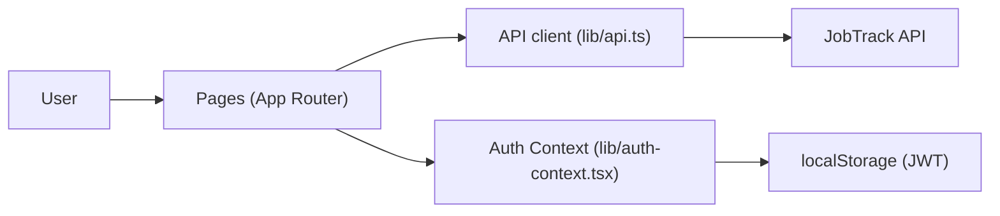

# JobTrack Frontend


> Web client for the JobTrack API. A job application tracker that lets users register, manage applications through a hiring pipeline, record status history, and review search statistics. Built with the Next.js App Router, TypeScript, and Tailwind CSS, with all form input validated by Zod.

- Backend repository: https://github.com/AndresUG04/jobtrack-api
- Live API: https://jobtrack-api-l102.onrender.com
- Live demo: deploy on Vercel and add the URL here

## Architecture



The client is organized around three boundaries:

- **API client.** Every request goes through a single `request<T>` helper in `lib/api.ts`. It attaches the `Authorization: Bearer <token>` header, sets JSON headers, parses responses, and throws a typed `ApiClientError`. No component calls `fetch` directly.
- **Authentication.** The JWT is persisted in `localStorage` under `jobtrack_token` and exposed through `AuthContext` (`useAuth`). On load the token is validated by calling `/api/auth/me`; a `401` from any request triggers a global logout.
- **Route protection.** Dashboard pages are wrapped in `<ProtectedRoute>`, which redirects to `/login` when no valid session exists.

Forms use React Hook Form with Zod resolvers, so client-side validation mirrors the backend rules before any request is sent.

## Features

- Email and password authentication (register, login, logout) with persisted sessions
- Full CRUD on applications: company, position, source, location, salary range, job URL, remote flag, applied date, and notes
- Status tracking across a nine-stage pipeline (Saved through Accepted/Rejected/Withdrawn) with a per-application status history timeline
- Application list with status filtering, debounced search, and pagination
- Dashboard with totals, active applications, response rate, and status distribution
- Loading, empty, and error states for every async view; toast notifications and confirmation dialogs for destructive actions
- Responsive layout for mobile, tablet, and desktop

## Tech Stack

| Layer | Technology |
| --- | --- |
| Framework | Next.js 16 (App Router) |
| Language | TypeScript 5 |
| UI library | React 19 |
| Styling | Tailwind CSS v4 |
| Forms and validation | React Hook Form + Zod |
| Icons | lucide-react |
| Notifications | Sonner |
| HTTP | Native fetch |
| Auth | JWT in localStorage via React Context |
| Deployment | Vercel |

## Quickstart

### Prerequisites

- Node.js 20.9 or later
- npm
- A running JobTrack API (use the hosted instance, or run the backend locally)

### Setup

```bash
# 1. Clone
git clone https://github.com/AndresUG04/jobtrack-frontend.git
cd jobtrack-frontend

# 2. Install dependencies
npm install

# 3. Configure environment
echo "NEXT_PUBLIC_API_URL=https://jobtrack-api-l102.onrender.com" > .env.local

# 4. Start the dev server
npm run dev
```

The app runs at http://localhost:3000.

### Scripts

| Command | Description |
| --- | --- |
| `npm run dev` | Start the development server |
| `npm run build` | Create a production build |
| `npm run start` | Serve the production build |
| `npm run lint` | Run ESLint |

## Environment Variables

Create a `.env.local` file in the project root.

| Variable | Example | Description |
| --- | --- | --- |
| `NEXT_PUBLIC_API_URL` | `https://jobtrack-api-l102.onrender.com` | Base URL of the JobTrack API. The `NEXT_PUBLIC_` prefix exposes it to the browser. |

## Project Structure

```
jobtrack-frontend/
├── app/
│   ├── layout.tsx                  Root layout: AuthProvider, font, toasts
│   ├── page.tsx                    Landing page
│   ├── login/                      Login page
│   ├── register/                   Register page
│   └── dashboard/
│       ├── layout.tsx              Protected layout (navbar + sidebar)
│       ├── page.tsx                Stats overview
│       └── applications/           List, create, detail, edit
├── components/
│   ├── ui/                         Button, Input, Select, Card, Modal, ...
│   ├── auth/                       LoginForm, RegisterForm, ProtectedRoute
│   ├── applications/               Form, list, status badge, history, modal
│   ├── dashboard/                  StatsCards, StatusDistribution
│   └── layout/                     Navbar, Sidebar
├── lib/
│   ├── api.ts                      Typed API client
│   ├── auth-context.tsx            Auth state and token persistence
│   ├── types.ts                    Shared types
│   ├── schemas.ts                  Zod validation schemas
│   └── utils.ts                    Status colors, date and class helpers
└── .env.local
```

## Deployment

The app is built for Vercel.

1. Import the repository into Vercel.
2. Add the environment variable `NEXT_PUBLIC_API_URL` set to the API base URL (for example `https://jobtrack-api-l102.onrender.com`).
3. Deploy. Vercel detects Next.js and uses the default build settings.

After the first deploy, add the resulting Vercel URL to the backend's `ALLOWED_ORIGINS` so CORS permits requests from the production frontend.

## License

Released under the MIT License.
